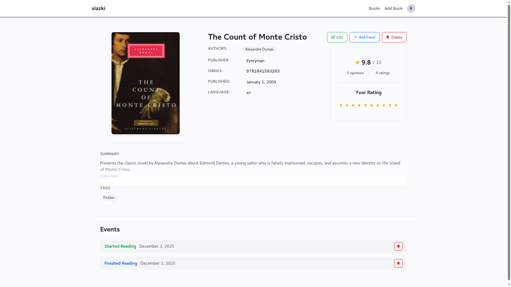
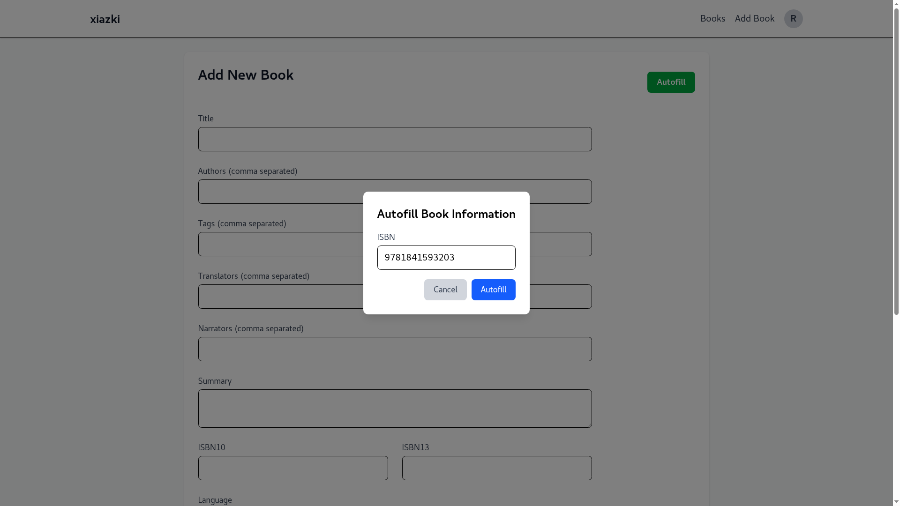
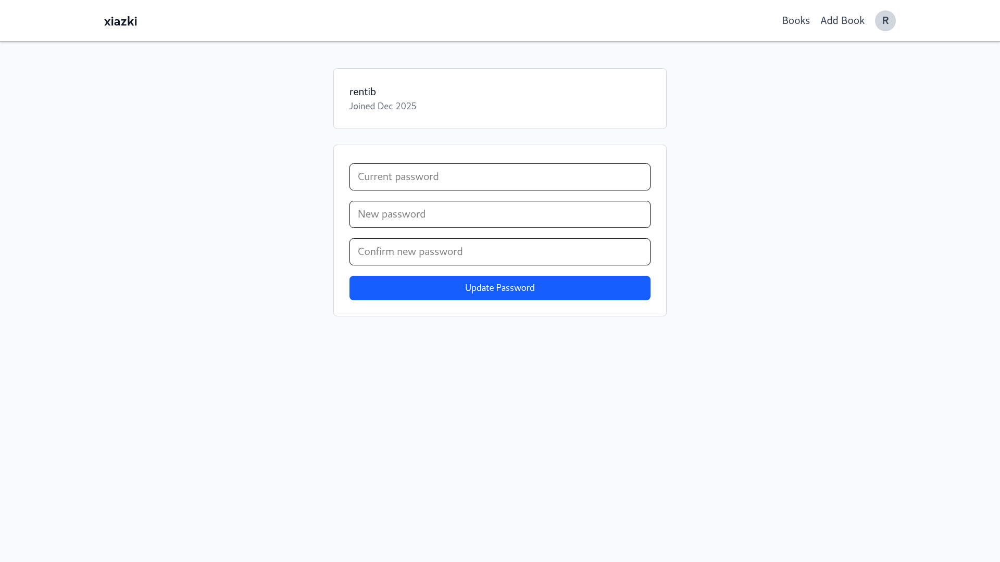
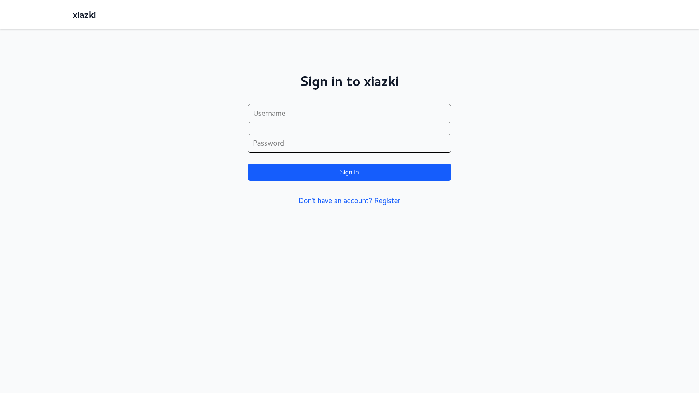
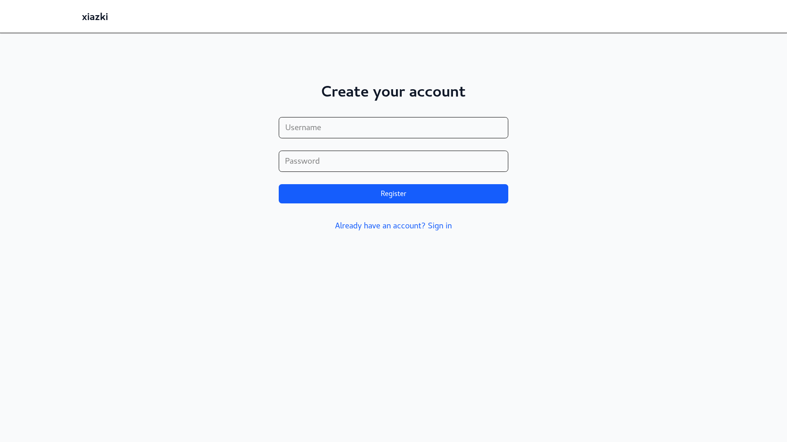

# xiazki

Lightweight, self-hosted application for tracking books.

## Why?
I started reading books, and thought it would be great to keep track of them.
I tried goodreads and hated it. Then self-hosting came to mind.
There are a few apps which do this, most notably
[jelu](https://github.com/bayang/jelu). It works, but has its issues: it's
slow, its design is questionable, and it uses a lot of memory.
Therefore, I decided to make *xiazki*. It currently is not ideal and lacks
features, but at least it deals with the aforementioned problems :-).

## Features:
- [x] password authentication
- [x] listing books
- [x] adding books
- [x] editing books
- [x] getting book metadata from ISBN ([openlibrary](https://openlibrary.org/), [googlebooks](https://books.google.com/))
- [x] events (*reading*/*finished*/*dropped*)
- [x] book reviews
- [ ] quotes
- [ ] bulk import
- [ ] dark mode and color schemes
- [ ] i18n, l10n (translations basically)
- [ ] docker
- [ ] marking books as *to read*
- [ ] advanced search features
- [ ] OAuth/LDAP
- [ ] documentation

The unfulfilled fields in the TODO list are sorted by priority, although it
doesn't mean, they will be done in this order.

## Screenshots
Book Details

Book List

Add Book

Author

Auto fill

Auto fill Results

Profile

Login

Register


## Building
- go 1.25

```sh
make xiazki
```

## Developing
- go 1.25
- [templ](https://templ.guide/quick-start/installation) 0.3.960
- [tailwind](https://tailwindcss.com/docs/installation/tailwind-cli) 4.1

```sh
make dev
```
